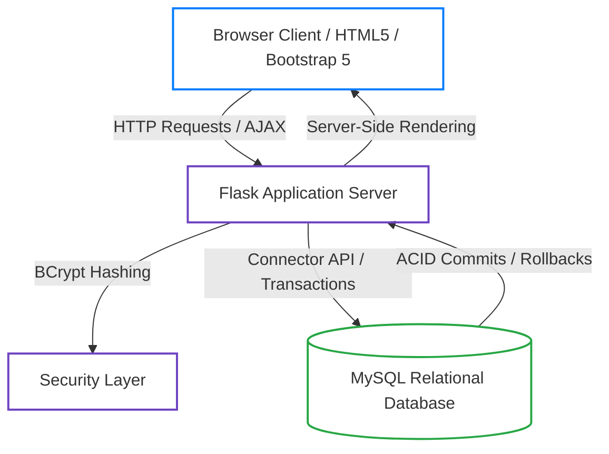
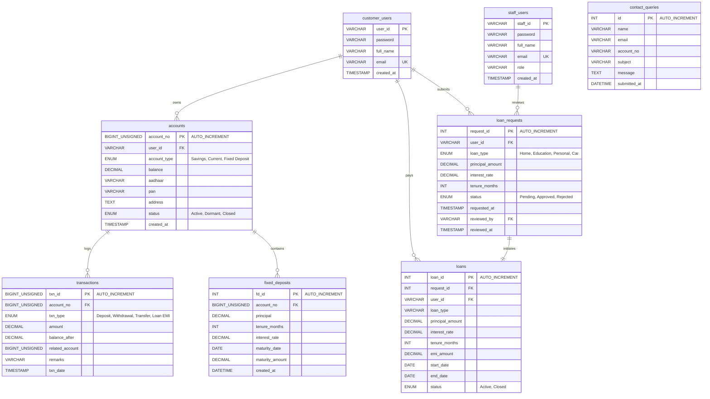

# 🏦 Smart Bank Management System (SBMS)

<p align="center">
  
</p>

<p align="center">
  <strong>Secure. Smart. Seamless Banking.</strong><br>
  <em>A Normalized, Transaction-Safe Database Management System Course Project</em>
</p>

<p align="center">
  <a href="https://www.python.org/"></a>
  <a href="https://flask.palletsprojects.com/"></a>
  <a href="https://www.mysql.com/"></a>
  <a href="https://getbootstrap.com/"></a>
  <a href="https://github.com/Dakshified/DBMS-Banking-system/blob/main/LICENSE"></a>
</p>

---

## 📖 Table of Contents
1. [Project Overview](#-project-overview)
2. [Key Architecture & Data Flow](#-key-architecture--data-flow)
3. [Database Design & Schema (3NF Validation)](#-database-design--schema-3nf-validation)
4. [Entity-Relationship Diagram (ERD)](#-entity-relationship-diagram-erd)
5. [Core Technical Deep-Dives](#-core-technical-deep-dives)
    - [ACID-Compliant Funds Transfer](#1-acid-compliant-funds-transfer-engine)
    - [Automated Loan EMI Compounder](#2-automated-loan-emi-compounder)
    - [Dynamic Report Mapper via SQL CASE Expressions](#3-dynamic-report-mapper-via-sql-case-expressions)
    - [Real-Time AJAX Recipient Validator](#4-real-time-ajax-recipient-validator)
6. [Role-Based Access Control (RBAC)](#-role-based-access-control-rbac)
7. [Installation & Local Setup](#-installation--local-setup)
8. [API Route Index](#-api-route-index)
9. [Future Roadmap](#-future-roadmap)
10. [Contributors & Course Info](#-contributors--course-info)

---

## 🌟 Project Overview
The **Smart Bank Management System (SBMS)** is a comprehensive web-based banking application designed to demonstrate robust database administration principles, relational safety, schema normalization, and dynamic frontend integration.

Unlike simple administrative scripts, SBMS simulates a dual-portal application where **Customers** manage savings, open fixed deposits, apply for loans, and transfer funds, while **Staff Users** evaluate risk, approve loans, create accounts, and generate auditing records.

### Core Capabilities:
- 🚀 **Transactional Consistency:** Bulletproof double-entry ledger logging built on MySQL database-level rollbacks.
- 📐 **Rigorous Database Integrity:** Fully normalized 3NF schema using explicit FOREIGN KEY mappings, Cascading Actions, and Check constraints.
- 💼 **Staff Risk Evaluation:** Full workflow for reviewing customer loan requests and auto-initiating loan payment tracks.
- 📊 **Dynamic Analytical Reports:** Staff can view unified ledger logs and download CSV files instantly generated from the database.

---

## 🏗️ Key Architecture & Data Flow
The system utilizes a modern, lightweight three-tier architecture that guarantees decoupling between database persistence, business rules, and UI presentations:



---

## 🗄️ Database Design & Schema (3NF Validation)
The repository defines an efficient relational model located in [sbms.sql](file:///c:/Users/Daksh%27s%20pc/OneDrive/Desktop/Course%20project/sbms.sql). All tables are designed to satisfy **Third Normal Form (3NF)** rules to eliminate redundancies:
1. **1NF:** Every column contains atomic values; no repeating groups.
2. **2NF:** It is in 1NF and all non-key attributes are fully functionally dependent on the primary key.
3. **3NF:** It is in 2NF and there are zero transitive dependencies (no non-key attribute depends on another non-key attribute).

### Schema Tables Description:

| Table Name | Primary Key | Key Attributes & Foreign Keys | Description |
| :--- | :--- | :--- | :--- |
| **`customer_users`** | `user_id` (VARCHAR) | Email (Unique), password, full_name | Holds customer profile metadata and hashed login credentials. |
| **`staff_users`** | `staff_id` (VARCHAR) | Email (Unique), role, full_name | Holds bank administrative staff metadata. |
| **`accounts`** | `account_no` (BIGINT AUTO) | `user_id` (FK ➔ `customer_users`), Aadhaar, PAN | Holds active banking profiles. Tracks checking/savings balances. |
| **`transactions`** | `txn_id` (BIGINT AUTO) | `account_no` (FK ➔ `accounts`), `related_account` | Chronological ledger entry tracker for deposit, withdrawal, and transfers. |
| **`loan_requests`**| `request_id` (INT AUTO) | `user_id` (FK ➔ `customer_users`), `reviewed_by` (FK ➔ `staff_users`) | Loan application records waiting for credit check reviews. |
| **`loans`** | `loan_id` (INT AUTO) | `request_id` (FK), `user_id` (FK) | Stores active loans with dynamic EMI amounts and tenure dates. |
| **`fixed_deposits`**| `fd_id` (INT AUTO) | `account_no` (FK ➔ `accounts`) | Holds short/long term term-deposit products accruing interest. |
| **`contact_queries`**| `id` (INT AUTO) | Name, email, subject, message, submitted_at | Audits visitor queries sent to support. |

---

## 📊 Entity-Relationship Diagram (ERD)
The relationships, foreign key bindings, and cardinalities are mapped in the diagram below:



---

## ⚙️ Core Technical Deep-Dives

### 1. ACID-Compliant Funds Transfer Engine
To ensure consistency during inter-account transfers, the system executes sender and receiver operations inside a unified transactional boundary. If any statement fails (e.g., recipient account missing, database error, server crash), the database rolls back immediately:

```python
# Extract from app.py showing implementation of ACID rules
try:
    # 1. Update sender balance
    new_sender_bal = float(sender['balance']) - amount
    cur.execute("UPDATE accounts SET balance=%s WHERE account_no=%s", (new_sender_bal, from_acc))
    
    # 2. Log Sender Debit Transaction
    cur.execute(
        "INSERT INTO transactions (account_no, txn_type, amount, balance_after, related_account, remarks) "
        "VALUES (%s, 'Transfer', %s, %s, %s, %s)",
        (from_acc, amount, new_sender_bal, to_acc, f"To: {to_acc}")
    )

    # 3. Update receiver balance
    new_receiver_bal = float(receiver['balance']) + amount
    cur.execute("UPDATE accounts SET balance=%s WHERE account_no=%s", (new_receiver_bal, to_acc))
    
    # 4. Log Receiver Credit Transaction
    cur.execute(
        "INSERT INTO transactions (account_no, txn_type, amount, balance_after, related_account, remarks) "
        "VALUES (%s, 'Transfer', %s, %s, %s, %s)",
        (to_acc, amount, new_receiver_bal, from_acc, f"From: {from_acc}")
    )

    # If all succeed, commit atomicity
    conn.commit()
    flash(f"₹{amount:.2f} transferred to Account {to_acc}!", "success")

except Exception as e:
    # Revert all changes in case of failure
    conn.rollback()
    flash("Transfer failed.", "danger")
```

---

### 2. Automated Loan EMI Compounder
When a bank manager approves a loan request, the backend automatically evaluates the monthly Equated Monthly Installment (EMI) based on the compounding formula:

$$EMI = P \times r \times \frac{(1 + r)^n}{(1 + r)^n - 1}$$

Where:
* $P$ = Principal Loan Amount
* $r$ = Monthly Interest Rate (Annual Rate / 12 / 100)
* $n$ = Loan Tenure (in Months)

```python
# Real-world calculation inside route execution
principal = float(req['principal_amount'])
tenure = int(req['tenure_months'])
rate = float(req['interest_rate']) / 100
monthly_rate = rate / 12

# Standard EMI compound equation
power = (1 + monthly_rate) ** tenure
emi = principal * monthly_rate * power / (power - 1)
```

---

### 3. Dynamic Report Mapper via SQL CASE Expressions
The transactions ledger utilizes SQL `CASE` logic. Since transfers record bidirectional entries (one for the sender and one for the receiver), this complex join groups them dynamically to output unified statements:

```sql
SELECT 
    t.txn_id,
    t.account_no,
    t.txn_type,
    t.amount,
    t.balance_after,
    t.remarks,
    t.txn_date,
    c.full_name,
    CASE 
        WHEN t.txn_type = 'Transfer' AND t.remarks LIKE 'To:%' THEN t.account_no
        WHEN t.txn_type = 'Transfer' AND t.remarks LIKE 'From:%' THEN t.related_account
    END AS from_account,
    CASE 
        WHEN t.txn_type = 'Transfer' AND t.remarks LIKE 'To:%' THEN t.related_account
        WHEN t.txn_type = 'Transfer' AND t.remarks LIKE 'From:%' THEN t.account_no
    END AS to_account
FROM transactions t
JOIN accounts a ON t.account_no = a.account_no
JOIN customer_users c ON a.user_id = c.user_id
WHERE t.txn_type != 'Transfer' OR t.remarks LIKE 'To:%'
ORDER BY t.txn_date DESC, t.txn_id DESC;
```

---

### 4. Real-Time AJAX Recipient Validator
To enhance the UI and avoid erroneous transfers, the transfer module calls a micro-service API `/get_account_holder/<account_no>` using asynchronous requests to instantly update and show the name of the beneficiary:

```javascript
// Located inside static/js/scripts.js (AJAX Call implementation)
document.getElementById('to_account_no').addEventListener('input', function() {
    let accountNo = this.value;
    let holderDiv = document.getElementById('account_holder_name');
    
    if (accountNo.length >= 3) {
        fetch(`/get_account_holder/${accountNo}`)
            .then(res => res.json())
            .then(data => {
                if (data.name) {
                    holderDiv.innerHTML = `<span class="text-success"><i class="fas fa-check-circle"></i> Holder: <b>${data.name}</b></span>`;
                } else {
                    holderDiv.innerHTML = `<span class="text-danger"><i class="fas fa-times-circle"></i> Invalid Account Number</span>`;
                }
            });
    } else {
        holderDiv.innerHTML = '';
    }
});
```

---

## 🔐 Role-Based Access Control (RBAC)

SBMS defines explicit functional isolation between general users, registered customers, and staff:

| Action | Visitor | Customer | Staff User (Admin/Clerk) |
| :--- | :---: | :---: | :---: |
| View Homepage & Calculate EMI Estimates | ✅ | ✅ | ✅ |
| Sign Up / Register New Account Profile | ✅ | 🚫 | 🚫 |
| Input KYC details (Aadhaar, PAN) & Request Account | 🚫 | ✅ | ✅ |
| Make Cash Deposits & Withdrawals | 🚫 | ✅ | 🚫 |
| Initiate Transfers & Open FDs | 🚫 | ✅ | 🚫 |
| Submit Loan Requests | 🚫 | ✅ | 🚫 |
| Approve/Reject Pending Loan Applications | 🚫 | 🚫 | ✅ |
| View Financial System Auditing Reports | 🚫 | 🚫 | ✅ |
| Export System-wide Statements to CSV | 🚫 | 🚫 | ✅ |

---

## 💻 Installation & Local Setup

### 📋 Prerequisites
Ensure you have the following installed on your machine:
- **Python 3.9+**
- **MySQL Server 8.0+**
- **pip** (Python package installer)

### 🛠️ Configuration Steps

#### 1. Clone & Navigate to Workspace
```bash
git clone https://github.com/Dakshified/DBMS-Banking-system.git
cd DBMS-Banking-system
```

#### 2. Configure Virtual Environment (Recommended)
```bash
python -m venv venv
# On Windows
venv\Scripts\activate
# On MacOS/Linux
source venv/bin/activate
```

#### 3. Install Required Dependencies
```bash
pip install flask mysql-connector-python bcrypt
```

#### 4. Setup MySQL Database
Log into your local MySQL console and execute the SQL file:
```bash
mysql -u root -p < sbms.sql
```
*Alternatively, open your MySQL Workbench, create a database named `bank_management`, and run the scripts inside [sbms.sql](file:///c:/Users/Daksh%27s%20pc/OneDrive/Desktop/Course%20project/sbms.sql).*

#### 5. Set Environment Configurations
Open [app.py](file:///c:/Users/Daksh%27s%20pc/OneDrive/Desktop/Course%20project/app.py) and configure your database credentials on line 22:
```python
def get_connection():
    return mysql.connector.connect(
        host='localhost',
        user='YOUR_MYSQL_USERNAME',      # Default: 'root'
        password='YOUR_MYSQL_PASSWORD',  # Update this to match your system
        database='bank_management'
    )
```

#### 6. Run the Application
```bash
python app.py
```
*The server will spin up on `http://127.0.0.1:5000/`.*

---

## 🔗 API Route Index

| HTTP Method | Path | Required Role | Functionality |
| :--- | :--- | :--- | :--- |
| **`GET`** | `/` | Guest | Serves the landing marketing homepage. |
| **`GET` / `POST`** | `/login` | Guest | Authenticates user; maps type to session memory. |
| **`GET` / `POST`** | `/signup` | Guest | Hashes credentials with BCrypt and registers user. |
| **`GET` / `POST`** | `/dashboard` | Customer / Staff | Serves the contextual user-specific dashboard. |
| **`GET`** | `/get_account_holder/<account_no>` | Customer | Asynchronous AJAX route returns holder name (JSON). |
| **`GET`** | `/reports` | Staff | Compiles joint records showing system-wide statements. |
| **`GET`** | `/export_reports` | Staff | Compiles financial logs and exports a `.csv` file attachment. |
| **`GET` / `POST`** | `/contact` | Guest | Captures visitor messages into customer support logs. |
| **`GET`** | `/logout` | Any | Terminates session; redirects to landing portal. |

---

## 🛣️ Future Roadmap
- [ ] **Two-Factor Authentication (2FA):** Integrate email OTPs during signup/transfers.
- [ ] **Interest Accrual Cron Job:** Background script to automatically calculate and add compound interest to FDs daily.
- [ ] **OCR KYC Reader:** Auto-validate Aadhaar and PAN cards via computer vision APIs.
- [ ] **Dark Mode Toggle:** Complete the CSS layout system to support modern glassmorphism dark-theme settings.

---

## 🎓 Contributors & Course Info
Developed as part of the **Database Management Systems (DBMS)** Laboratory Course Project.
* **Academic Term:** 2025-2026
* **Database Engine:** MySQL Server
* **Tech Stack:** Python Flask, Bootstrap 5, MySQL-Connector-Python, BCrypt.

---
<p align="center">Made with ❤️ for Academic Excellence in DBMS.</p>
